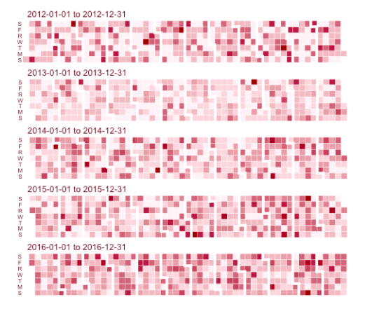
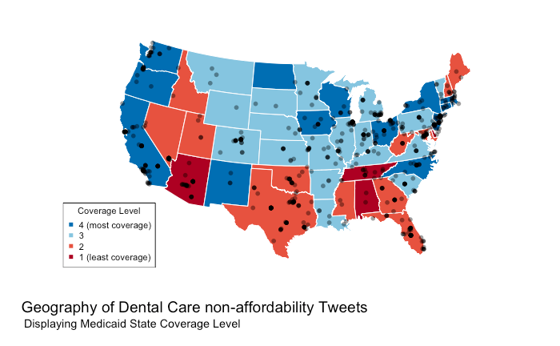
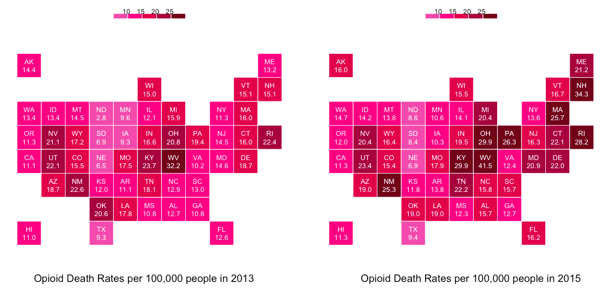

### Welcome to izzykayu's github homepage
Love of data science :crystal_ball: Creative and Passionate :pencil: Futurist :green_heart: Always trying to learn more :sparkles: You can reach me at [isabel.metzger@nyumc.org](isabel.metzger@nyumc.org) or [linkedin](https://www.linkedin.com/in/isabelmetzger)

:camera: instagram:[@datavizgirls](https://www.instagram.com/datavizgirls/)

### Some dataviz examples
>Heat map of Accidental Drug Deaths from 2012 - 2016

>Twitter Map using Google Maps Geolocation API

#### TEAM PROJECTS:
team members: _Isabel Metzger, Lorel Burns, DDS, Ana Raghunath_
1. [Machine Learning in Dental Radiology: Interpretation of Periapical Lesions Associated with Maxillary Molars]
2. [Predicting tweeter’s state insurance coverage level via tweeter's profile text and tweet text](izzykayu.github.io/twitterdental.md)
3. [Exploring Dental Care Affordability via Twitter: A Descriptive Study (power point pilot study overview)](https://github.com/izzykayu/izzykayu.github.io/blob/master/DentalTweets/DentalCareAffordabilityViaTwitterPilot.pdf)

#### TERM PROJECTS:
1. Natural Language Processing in identification of disease states in the MIMIC III dataset Medical Notes
2. Modeling the Health Insurance Marketplace client
3. Mortality Risk Prediction Model Using Natural Language Processing of Electronic Medical Records
4. Identifying social media markers of substance abuse symptoms via tweets: Four predictive models
5. Supervised Learning predicting Heroin Death vs Non Heroin Death in CT Accidental Drug Related Deaths Government Dataset 

### PERSONAL PROJECTS:
1. DaniBot _(Chatbot based off my best friend Danielle because she is hilarious)_

## Data Visualization and Exploratory Data Analysis
## REAL TALK: Opioids
Growing up in a working-class community where drugs offered comfort to many, I witnessed relatives and friends struggle with drug addiction, some until it killed them. By the time I turned 21, my uncle had died of Hepatitis C, contracted through needle sharing, and three of my friends had fatally overdosed on opiates. These losses forced me to confront the complexity of pharmacology at an early age—that drugs designed to maximize health often contribute to the undoing of vulnerable lives.

We as clinicians and health data scientists need to assume some responsibility for moving the field in a direction where clinicians are better trained to prevent and recognize drug abuse, and drug death, especially when working in resource-strapped communities. My community deserves this. **Every community deserves this.**

_This project uses multiple government open data sets_
1. **NATIONAL SNAPSHOT**: Glimpse of current US trends in opioid overdose death rates.
2. Machine Learning Prediction Model: heroin death vs accidental drug death with no heroin found in the body.
3. Additionally, I provide some analysis in trying to detect overprescribing of opioids.
### 1. NATIONAL SNAPSHOT
#### State Opioid Death Rates, adjusted for age and population.

#### % Change in Opioid Death Rates in States from 2013 to 2014 and 2014 to 2015.

#### Opioid Death Rates, adjusted for age and population, Region sums, 2013-2015.

#### Opioid Death Rates, adjusted for age and population, Region sums, 2013-2015.

#### Opioid Death Rates, adjusted for age and population, Region sums, 2013-2015.

**How I prepared the data and made these plots** :bar_chart: **Additionally, these links provide more information**
[pdf format](https://github.com/izzykayu/izzykayu.github.io/blob/master/national/graphsglimpse.pdf),
[rmarkdown file](https://github.com/izzykayu/izzykayu.github.io/blob/master/national/graphsglimpse.Rmd)

**Sources:**
[CDC Drug Overdose Dataset](https://www.cdc.gov/drugoverdose/data/statedeaths.html),
[CT Accidental Drug Deaths Dataset](https://catalog.data.gov/dataset/accidental-drug-related-deaths-january-2012-sept-2015)
