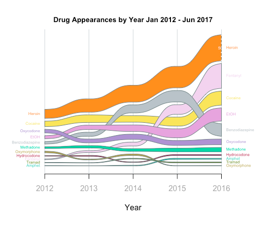
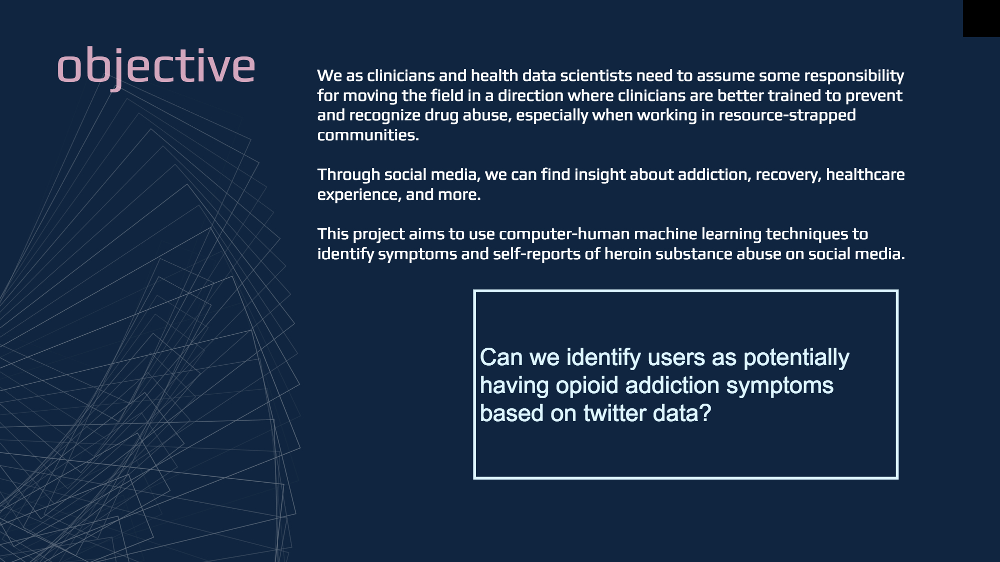
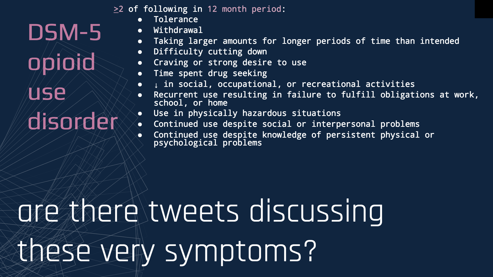
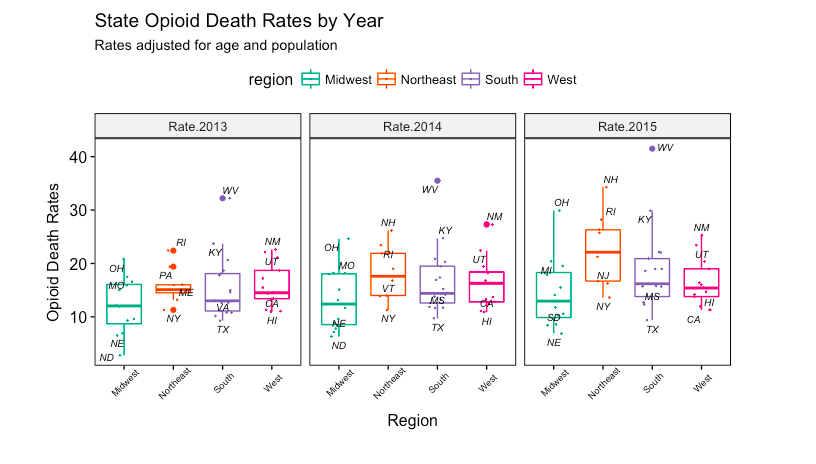
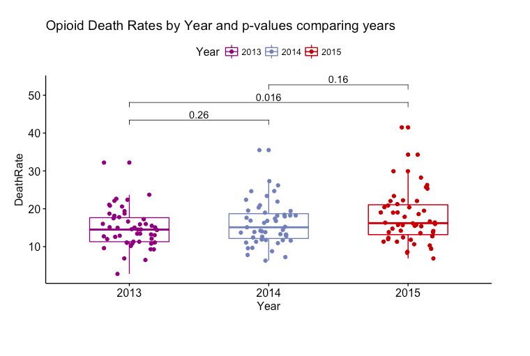
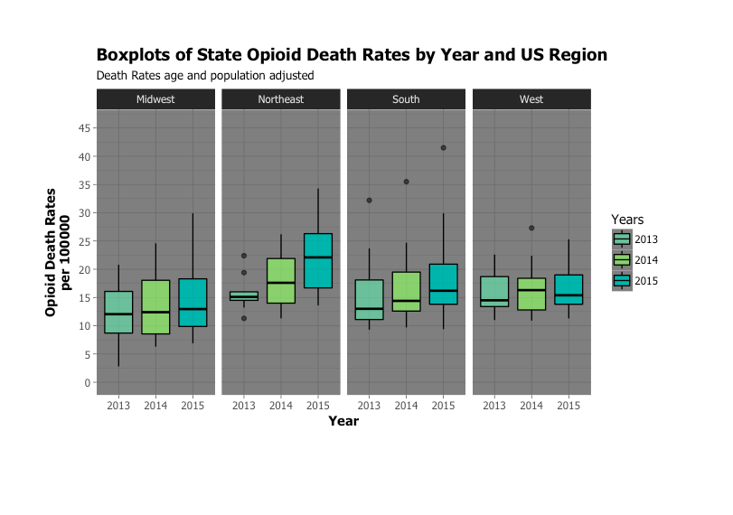
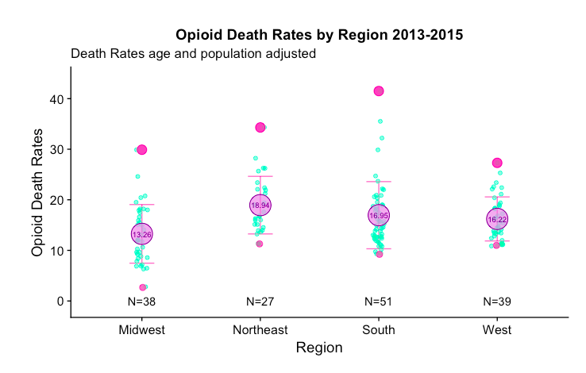

### Welcome to izzykayu's github homepage
I started learning Python :snake: in July and R in September. But I've always coded a little bit (I wanted my _myspace_ to look pretty). I'm always trying to learn more :sparkles: so any feedback is greatly appreciated! I'm diagnosed with four learning disabilities including dyslexia and ADHD, so if I can start coding--you definitely can. :sunny: Love of data science and tattoos :crystal_ball: Creative and Passionate :pencil: Futurist :green_heart: You can reach me at [isabel.metzger@nyumc.org](isabel.metzger@nyumc.org) or [linkedin](https://www.linkedin.com/in/isabelmetzger) or my newly made [twitter](https://twitter.com/diamondcrowbar):sparkles: or [quora](https://www.quora.com/profile/Isabel-Metzger-2):bust_in_silhouette:

:camera: instagram:[@datavizgirls](https://www.instagram.com/datavizgirls/)

### Some dataviz examples
>Heat map of CT Accidental Drug Deaths from 2012 - 2016

>Alluvial Time Series plot CT Drug Deaths
>Counts of Drugs Found in the Body at time of death

> Deaths on the Rise (CT Dataset)
![IMAGE]

>Twitter Map using Google Maps Geolocation API

Last semester's term project with 4 predictive models:
> 

### So What did I query?
As someone who provides HCV/HIV testing and needle exchange services,
I wanted to follow a specific guideline and used the DSM-5 criteria for opioid use disorder:

> 
>

#### TEAM PROJECTS:
team members: _Isabel Metzger, Mark Grivainis, Brandon Mannion_
1. [Identifying ADRs from Medical Notes with Natural Language Processing and Deep Learning Methods]

team members: _Isabel Metzger, Akshay T, Anupama Santhosh, Ethan Wu_
1. [Creating a Natural Language Interface with Clinical Text]

team members: _Isabel Metzger, Julia Mahler, Teny Joseph, Nam Nguyen_
1. [Patient Quality Health Innovation Challenge]
_Twitter sentiment and chatbot creation: I utilized a deep learning emoji method and will be uploading the tutorial link soon_

team members: _Isabel Metzger, Lorel Burns, DDS, Ana Raghunath_
1. [Machine Learning in Dental Radiology: Interpretation of Periapical Lesions Associated with Maxillary Molars]
2. [Predicting tweeter’s state insurance coverage level via tweeter's profile text and tweet text](izzykayu.github.io/twitterdental.md)
3. [Exploring Dental Care Affordability via Twitter: A Descriptive Study (power point pilot study overview)](https://github.com/izzykayu/izzykayu.github.io/blob/master/DentalTweets/DentalCareAffordabilityViaTwitterPilot.pdf)

#### INDIVIDUAL PROJECTS:
1. [Identifying social media markers of substance abuse symptoms via tweets: Four predictive models](https://github.com/izzykayu/izzykayu.github.io/blob/master/herointweets/ML_4models_tweetanalysis_heroin_IzzyKayu.pdf)
2. [Supervised Learning predicting Heroin Death vs Non Heroin Death in CT Accidental Drug Related Deaths Government Dataset]
3. [Zero Start: Predicting 2 month Mortality with Minimal Patient Records]

### PERSONAL PROJECTS:
1. DaniBot _(Chatbot based off my best friend Danielle because she is hilarious)_
2. Data Visualization of Tattoo Trends
3. Basketball Data Visualization #brooklynnets 

## Data Visualization and Exploratory Data Analysis
## REAL TALK: Opioids
Growing up in a working-class community where drugs offered comfort to many, I witnessed relatives and friends struggle with drug addiction, some until it killed them. By the time I turned 21, my uncle had died of Hepatitis C, contracted through needle sharing, and three of my friends had fatally overdosed on opiates. These losses forced me to confront the complexity of pharmacology at an early age—that drugs designed to maximize health often contribute to the undoing of vulnerable lives.

We as clinicians and health data scientists need to assume some responsibility for moving the field in a direction where clinicians are better trained to prevent and recognize drug abuse, and drug death, especially when working in resource-strapped communities. My community deserves this. **Every community deserves this.**

_This project uses multiple government open data sets_
1. **NATIONAL SNAPSHOT**: Glimpse of current US trends in opioid overdose death rates.
2. Machine Learning Prediction Model: heroin death vs accidental drug death with no heroin found in the body.
3. Additionally, I provide some analysis in trying to detect overprescribing of opioids.
### 1. NATIONAL SNAPSHOT
#### State Opioid Death Rates, adjusted for age and population.

#### Change in Opioid Death Rates in States from 2013 - 2014. 
>When Opioid Deaths are adjusted for age and population, we can see that West Virginia currently has the highest rates of Opioid Overdose Deaths not only in the South, but for all states. In the Northeast, New Hampshire and Rhode Island have the highest Opioid Overdose Death Rates.

#### Opioid Death Rates by Year Compared with t-test p-values.

#### What states have significant Change in Opioid Death Rates? 
>Can we find novel ways in machine learning to save lives?

#### Summary Statistics on US Regions and Opioid Death Rates
>Summary statistics of Death Rates for US regions in 3 years

**How I prepared the data and made these plots** :bar_chart: 
[pdf format](https://github.com/izzykayu/izzykayu.github.io/blob/master/national/graphsglimpse.pdf),
[rmarkdown file](https://github.com/izzykayu/izzykayu.github.io/blob/master/national/graphsglimpse.Rmd)

**Sources:**
[CDC Drug Overdose Dataset](https://www.cdc.gov/drugoverdose/data/statedeaths.html)
[CT Accidental Drug Deaths Dataset](https://catalog.data.gov/dataset/accidental-drug-related-deaths-january-2012-sept-2015)
