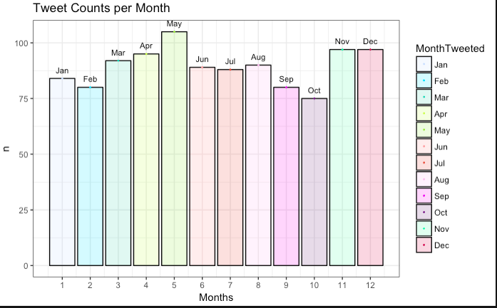

### Welcome
Love of data science :crystal_ball: Creative and Passionate :pencil: Futurist :green_heart: Always trying to learn more :sparkles: You can reach me at [isabel.metzger@nyumc.org](url) or [linkedin](https://www.linkedin.com/in/isabel-metzger-53675366/)
[instagram:](https://www.instagram.com/datavizgirls/) @datavizgirls

### Some dataviz examples

Calendar Heat map of Accidental Drug Deaths from 2012 - 2016 in CT

Mapping dental "can't afford" tweets with medicaid dental coverage levels

### Data is everywhere, let's see how we can learn more about human health through various datasets!
### TEAM PROJECTS:
team members: Isabel Metzger, Lorel Burns, DDS, Ana Raghunath
1. [Machine Learning in Dental Radiology: Interpretation of Periapical Lesions Associated with Maxillary Molars](izzykayu.github.io/twitterdental.md)
2. [Predicting tweeter’s state insurance coverage level via tweeter's profile text and tweet text](izzykayu.github.io/twitterdental.md)
3. [Exploring Dental Care Affordability via Twitter: A Descriptive Study](izzykayu.github.io/twitterdental.md)

### TERM PROJECTS:
1. Natural Language Processing in identification of disease states in the MIMIC III dataset Medical Notes
2. Modeling the Health Insurance Marketplace client
3. Mortality Risk Prediction Model Using Natural Language Processing of Electronic Medical Records
4. Identifying social media markers of substance abuse symptoms via tweets: Four predictive models
5. Supervised Learning predicting Heroin Death vs Non Heroin Death in CT Accidental Drug Related Deaths Government Dataset 

### PERSONAL PROJECTS:
1. DaniBot _(Chatbot based off my best friend Danielle because she is hilarious)_

## Data Visualization and Exploratory Data Analysis
# REAL TALK. Opioids
Growing up in a working-class community where drugs offered comfort to many, I witnessed relatives and friends struggle with drug addiction, some until it killed them. By the time I turned 21, my uncle had died of Hepatitis C, contracted through needle sharing, and three of my friends had fatally overdosed on opiates. These losses forced me to confront the complexity of pharmacology at an early age—that drugs designed to maximize health often contribute to the undoing of vulnerable lives.

### AND ACTUALLY THOUGH
We as clinicians and health data scientists need to assume some responsibility for moving the field in a direction where clinicians are better trained to prevent and recognize drug abuse, and drug death, especially when working in resource-strapped communities. My community deserves this. **Every community deserves this.**

_This project uses multiple government open data sets_
1. Glimpse of current US trends in overdose deaths and opioid use.
2. Machine Learning Prediction Model: heroin death vs accidental drug death with no heroin found in the body.
3. Additionally, I provide some analysis in trying to detect overprescribing of opioids.
# NATIONAL SNAPSHOT
### State Opioid Death Rates, adjusted for age and population.

**Sources:**
[open gov dataset here](https://catalog.data.gov/dataset/accidental-drug-related-deaths-january-2012-sept-2015)
